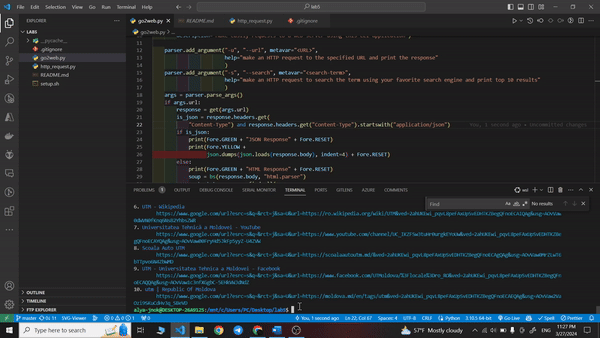

# Python application for sending requests via websockets



## Setup

1. Clone the repository and navigate to the project directory.

```bash
    git clone git@github.com:alya1007/web-lab-5.git
    cd web-lab-5
```

2. Execute the `setup.sh` script to create a symbolic link and be able to execute the application with the command `go2web`.
   Note: you will need a unix-based terminal to run the script.

```bash
    chmod +x setup.sh
    ./setup.sh
```

3. Run the application with the command `go2web`.

```bash
    go2web
```

## Commands

```bash
go2web -u <URL>         # make an HTTP request to the specified URL and print the response
go2web -s <search-term> # make an HTTP request to search the term using your google and print top 10 results
go2web -h               # show this help
```
